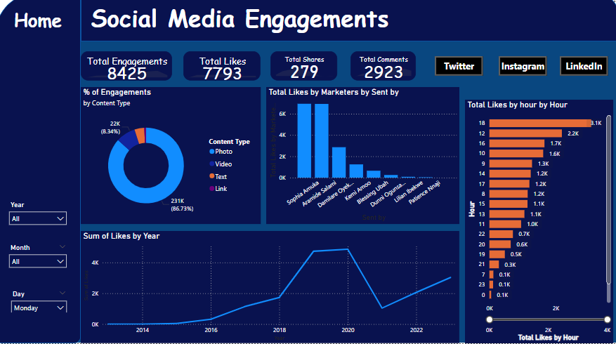
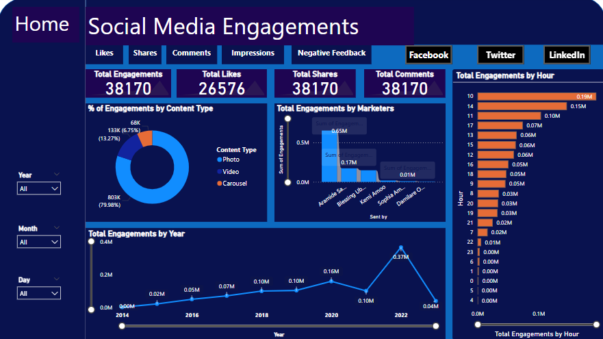
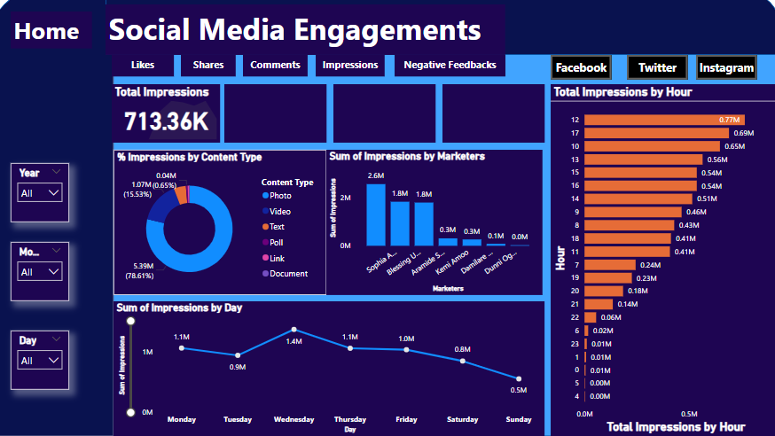
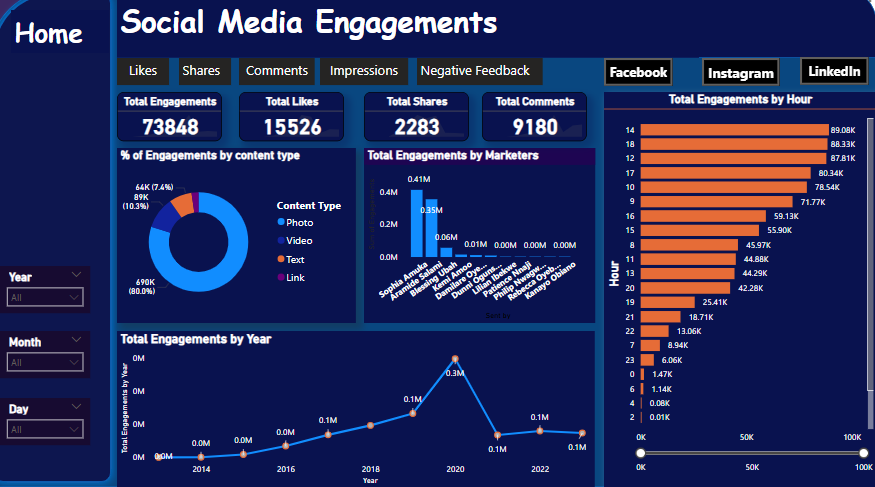

## 📊 Descriptive Analysis Overview

These dashboards are a powerful lens, giving a clear and concise view into our social media performance. Designed with a sleek, dark aesthetic, they images consistently offer interactive filters, allowing us to critically examine our data by year, month, or even specific days. Each screen provides critical insights tailored to its respective platform: for LinkedIn, the focus is squarely on "Impressions," showing us how many eyes are actually seeing our content. However, for Facebook, Instagram, and Twitter, the emphasis shifts to genuine "Engagements"—that's the real activity of likes, shares, and comments—with Instagram uniquely highlighting "Saves" as a measure of content value.

What these tools truly illuminate is the exact art of social media strategy. We quickly discern that the content types which perform exceptionally well on one platform might not achieve the same traction on another. For instance, sharing direct "Links" proves highly effective for generating impressions on LinkedIn and driving engagement on Twitter, while on Facebook and Instagram, it is the captivating "Photos" that consistently perform the magic, drawing in significant interaction. Furthermore, these dashboards clearly identify our top-performing marketers and pinpoint the optimal times of day to post, ensuring our content lands when our audience is most active. Ultimately, they equip us with actionable intelligence, guiding our efforts to connect more deeply and strategically with our audience across every digital channel.

---

### 🧮 1. Facebook Social Media Engagement.

This dashboard focuses on Facebook engagement, displaying "Total Engagements" at 214,789, with "Total Likes" at 48,241, "Shares" at 1,338, and "Comments" at 19,032.
"Photo" content is the dominant engagement driver on Facebook, accounting for 87.35% of all interactions, significantly outperforming other content types.
"Sophia Amaka" and "Damian Chuks..." are the leading marketers for generating likes, and prime engagement hours are identified as 5 PM, 10 AM, and 2 PM.
Historical trends show fluctuating "Likes by Year," providing a long-term view of audience engagement evolution on the Facebook platform.
---

### 📈 2. Instagram Social Media Engagement.

The Instagram dashboard highlights "Total Engagements" at 38,170, with key metrics including "Total Likes" (26,576), "Total Saves" (2,224), and "Total Comments" (9,370).
"Photo" content overwhelmingly leads engagement on Instagram, contributing nearly 80% of total interactions, underscoring its visual-first nature.
"Aramide S..." and "Blessing Ub..." are the top marketers for engagement, with peak engagement occurring around 10 AM, 2 PM, and 11 AM.
The "Total Engagements by Year" chart shows a fluctuating trend, with a significant peak around 2021, providing historical context for Instagram strategy.

---

### 🧭 3. LinkedIn Social Media Engagement.

This Power BI dashboard provides a high-level overview of social media impressions, leveraging a dark theme and interactive filters for detailed temporal analysis.
It highlights "Total Impressions" at 713.36K and shows that "Link" content overwhelmingly drives 78.61% of impressions, making it the most effective content type for reach.
"Sophia A..." and "Blessing U..." are identified as top-performing marketers in generating impressions, while peak impression times are around 12 PM, 5 PM, and 10 AM.
The dashboard also reveals weekly trends in impressions, indicating fluctuations in content visibility throughout different days of the week, crucial for strategic scheduling.
---

### 🧱 4. Twitter Social Media Engagement.

This Twitter-specific dashboard tracks "Total Engagements" at 73,848, broken down into "Total Likes" (15,526), "Total Shares" (2,283), and "Total Comments" (9,180).
"Link" content is the most effective format for driving engagement on Twitter, responsible for 80.0% of interactions, highlighting its role in content amplification.
"Sophia Amaka" is the primary marketer generating engagements, and optimal posting times are identified as 2 PM, 6 PM, and 12 PM.
Engagement trends over the years show a peak around 2020 before a subsequent decline, offering insights into long-term performance on the platform.

## 🔍 Summary
These four Power BI dashboards offer a comprehensive overview of social media engagement across LinkedIn, Facebook, Instagram, and Twitter. They all share a dark theme and interactive filters, allowing for in-depth analysis of performance over time. While the LinkedIn dashboard emphasizes "Impressions," the Facebook, Instagram, and Twitter dashboards focus on direct "Engagements" like likes, shares, and comments, with Instagram uniquely tracking "Saves." This differentiation highlights platform-specific user interactions. Crucially, the dashboards consistently reveal key insights for optimizing social media strategy, showing that "Link" content performs best on LinkedIn and Twitter, while "Photo" content drives engagement on Facebook and Instagram. They also identify top marketers and prime engagement times, providing actionable data to refine content strategies, allocate resources, and boost audience interaction across all platforms.

---
